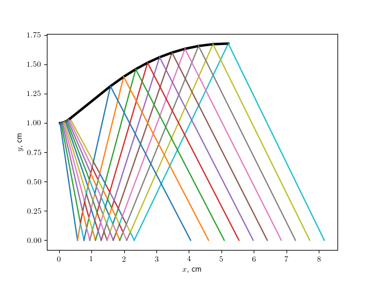

# Propulsion Systems Programming Portfolio

## About This Portfolio

This portfolio demonstrates various projects that I have been involved with in the area of propulsion system design.

The focus of this particular site is to showcase codes and solutions to various propulsion projects and their implementation in Python.

## [Software Manual](Software_Manual/SWMToC.md)

## [Applications](./HomeworkToC.md)

Contact Me: [christianrbolander@gmail.com](mailto:christianrbolander@gmail.com)
